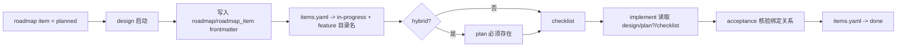

# feature-handoff-contract design

## 0. 术语约定

| 术语 | 定义 | 防冲突结论 |
|---|---|---|
| roadmap item | roadmap items.yaml 中的一条子 feature 记录，承载 slug、依赖、状态与 feature 目录名 | 当前仓库已在 `workflow-hybridization` 中使用；本 feature 继续沿用，不另起 plan 侧状态表 |
| handoff contract | roadmap、design、plan、checklist、acceptance 之间谁写什么、谁在何时更新什么字段的协议 | 本 feature 的目标就是把这件事写清楚，防止 plan 成为旁路产物 |
| feature directory binding | roadmap item 的 `feature` 字段与 feature 目录名之间的一一绑定关系 | design 启动时写入，acceptance 完成时据此回查与回写 |
| plan presence rule | 什么情况下 plan 必须存在，以及缺失时谁该失败 | 本 feature 不决定哪些 feature 必须 hybrid，只决定一旦是 hybrid，plan 缺失时流程如何拒绝继续 |

## 1. 决策与约束

### 需求摘要

**做什么**：定义并落盘 roadmap、design、plan、checklist、acceptance 的交接协议，重点补清三个问题：
1. roadmap item 在 design / acceptance 阶段如何更新状态与 `feature` 绑定；
2. hybrid feature 中 plan 与 checklist、acceptance 的依赖关系如何表达；
3. 何时允许跳过 plan，何时必须因为 plan 缺失而停下来。

**为谁**：NewCodeStable 的维护者与使用者。维护者需要统一的状态机和 frontmatter 协议，避免 feature 进入“design、plan、roadmap 三份文档各说各话”；使用者需要看到一条 feature 时，知道该读哪份文件、改哪份状态、验收后会回写哪里。

**成功标准**：
1. 共享约定中明确 roadmap item、design frontmatter、plan presence rule、acceptance 回写责任之间的关系。
2. `cs-feat-design`、`cs-feat-impl`、`cs-feat-accept` 对“什么时候必须存在 plan、什么时候可以没有 plan”说法一致。
3. roadmap 起头的 hybrid feature 能通过 design frontmatter、feature 目录名和 items.yaml 完成状态闭环，不产生第二套平行状态。
4. acceptance 在 hybrid feature 下能明确校验 plan 是否存在、是否与 design / checklist 绑定一致。

**明确不做**：
- 不实现自动校验脚本；本 feature 只定义协议和手工流程口径。
- 不改 roadmap item 的字段集合，不新增第二份 plan 专用 yaml。
- 不决定“所有标准 feature 是否都必须有 plan”；只定义一旦命中 hybrid 口径，plan 缺失如何处理。
- 不处理 issue / refactor 与 roadmap 的衔接。
- 不做历史 feature 的批量补写与状态回填。

### 复杂度档位

走“项目内部工具”默认档位，仅偏离两项：
- 可读性 = public（偏离默认 team 的原因：状态机和 frontmatter 协议需要给用户、后续技能和未来 feature 作者直接阅读）
- 兼容性 = backward-compatible（偏离默认 current-only 的原因：legacy feature 与已有 roadmap item 必须继续成立）

### 关键决策

1. **roadmap item 仍然只由 design 与 acceptance 写状态，不让 plan 单独写状态**  
   plan 是 step narrative，不是进度真相源；如果 plan 也写状态，就会出现第三套并行状态。

2. **hybrid feature 的 plan presence rule 由 design frontmatter 和产物存在性共同决定**  
   不是“看到文件就算 hybrid”，而是“design 决定这条 feature 采用 hybrid 口径，随后必须有真实 plan 文件存在”。

3. **feature 目录名是 roadmap / design / plan / checklist / acceptance 的唯一绑定键**  
   不新增额外的 execution id；一切都围绕 `YYYY-MM-DD-{slug}` 目录名闭环。

4. **acceptance 是唯一终态写回点**  
   design 启动时把 roadmap item 置 `in-progress`；只有 acceptance 能把它置 `done`。

## 2. 名词与编排

### 2.1 名词层

#### 现状

- roadmap items.yaml 已有 `slug / description / depends_on / status / feature / minimal_loop / notes` 字段。来源：`.codestable/reference/shared-conventions.md` 第 2.5 节。
- `cs-feat-design` 已在 roadmap 起头时写 `roadmap` / `roadmap_item` frontmatter，并把 item 状态改为 `in-progress`。来源：`cs-feat-design/SKILL.md`。
- `cs-feat-accept` 已在验收时回写 item 为 `done`。来源：`cs-feat-accept/SKILL.md`。
- `feature-plan` 已是共享约定中的真实产物，但当前还没有明说“什么时候必须存在、缺失时谁应该失败”。来源：`.codestable/reference/shared-conventions.md`、`cs-feat-impl/SKILL.md`、`cs-feat-accept/SKILL.md`。

#### 变化

- 明确 `plan presence rule`：
  - legacy feature：`plan.md` 可不存在
  - hybrid feature：若 design 采用 hybrid 口径，则 `{slug}-plan.md` 必须存在，implement / acceptance 启动检查都应把它视为必需输入
- 明确 `feature directory binding`：
  - items.yaml 的 `feature` 字段 = feature 目录名
  - design frontmatter 的 `feature` 字段 = 同一个目录名
  - plan frontmatter 的 `feature` 字段 = 同一个目录名
- 明确 handoff 责任：
  - design：写 `roadmap` / `roadmap_item` frontmatter，回写 `in-progress`
  - implement：消费 design / plan / checklist，但不写 roadmap 状态
  - acceptance：核验绑定关系，回写 `done`

#### 接口示例

design frontmatter：

```yaml
---
feature: 2026-06-01-demo
roadmap: workflow-hybridization
roadmap_item: execution-plan-artifact
status: approved
---
```

plan frontmatter：

```yaml
---
doc_type: feature-plan
feature: 2026-06-01-demo
design: demo-design.md
status: approved
---
```

roadmap item：

```yaml
- slug: execution-plan-artifact
  status: in-progress
  feature: 2026-06-01-execution-plan-artifact
```

### 2.2 编排层



#### 现状

- roadmap → design → acceptance 的状态回写骨架已存在，但 plan 的存在性与绑定关系没有被单独定义。来源：共享约定、`cs-feat-design/SKILL.md`、`cs-feat-accept/SKILL.md`。
- implement / acceptance 知道 hybrid 时要读 plan，但还缺少“plan 缺失时必须失败”的显式协议。来源：`cs-feat-impl/SKILL.md`、`cs-feat-accept/SKILL.md`。

#### 变化

- design 启动 roadmap item 后，必须同时固定三件事：`feature` 目录名、`roadmap` / `roadmap_item` frontmatter、items.yaml 的 `in-progress` 状态。
- hybrid feature 下，plan 变成 design 与 checklist 之间的必经节点；plan 缺失时 implement / acceptance 不得继续。
- acceptance 除了核验实现，还要核验三向绑定一致：design.feature = plan.feature = items.yaml.feature。

#### 流程级约束

- **state ownership**：roadmap 状态只允许 design 写 `in-progress`、acceptance 写 `done`。
- **binding rule**：feature 目录名是跨文档唯一绑定键。
- **plan presence**：只有命中 hybrid 口径时才强制 plan；一旦强制，plan 缺失必须视为流程错误。
- **no side channel**：plan 不单独维护 progress 状态，不写 roadmap item 状态。

### 2.3 挂载点清单

- `.codestable/reference/shared-conventions.md`：补充 handoff contract、plan presence rule、binding rule — 修改
- `cs-feat-design/SKILL.md`：明确 design 启动时的三向写入责任 — 修改
- `cs-feat-impl/SKILL.md`：明确 hybrid feature 时 plan 缺失应视为启动失败 — 修改
- `cs-feat-accept/SKILL.md`：明确验收时要核验 design / plan / items 的三向绑定 — 修改
- `.codestable/features/2026-06-01-feature-handoff-contract/`：新增当前 feature 的 design / checklist 样板；如走 hybrid 也会新增 plan 样板 — 修改

### 2.4 推进策略

1. **共享协议骨架**：先在 shared conventions 写清 state ownership、binding rule、plan presence rule  
   退出信号：共享约定能独立解释谁在何时更新哪些状态字段
2. **design 启动责任**：更新 `cs-feat-design/SKILL.md` 的 roadmap 起头与 plan 生成说明  
   退出信号：design 阶段对 `roadmap` / `roadmap_item` / `feature` 的写入责任清晰
3. **implement 启动门槛**：更新 `cs-feat-impl/SKILL.md`，明确 hybrid feature 下缺 plan 要停  
   退出信号：implement 不再把 plan 缺失当成可忽略信息
4. **acceptance 回写闭环**：更新 `cs-feat-accept/SKILL.md`，明确验收时要校验三向绑定并再写 `done`  
   退出信号：acceptance 不只看实现，还看文档绑定与状态闭环
5. **当前 feature 自证**：当前 feature 至少产出 design + checklist；若 design 判为 hybrid，则同时产出 plan 样板，证明协议可落地  
   退出信号：当前 feature 目录与 roadmap item 之间的绑定关系可以被人工核验

### 2.5 结构健康度与微重构

##### 评估
- 文件级 — `.codestable/reference/shared-conventions.md`：已有 roadmap ↔ feature 衔接协议，本次补的是状态所有权和存在性约束，仍属同一主题。
- 文件级 — `cs-feat-design/SKILL.md` / `cs-feat-impl/SKILL.md` / `cs-feat-accept/SKILL.md`：都是既有阶段职责内的协议澄清，不引入第二主题。
- 目录级 — 当前 feature 目录将新增 design/checklist（以及可能的 plan 样板），目录规模健康。
- compound convention：当前 compound 为空，未命中可复用 convention。

##### 结论：不做

本 feature 不做微重构，原因是改动集中在协议澄清与状态绑定说明，不涉及职责混杂或目录摊平问题。

## 3. 验收契约

- **S1**：共享约定能解释 roadmap item、design frontmatter、plan presence rule、acceptance 回写责任之间的关系。
- **S2**：`cs-feat-design` 说明了 design 阶段必须如何写 `roadmap / roadmap_item / feature` 绑定。
- **S3**：`cs-feat-impl` 说明 hybrid feature 缺 plan 时不能继续。
- **S4**：`cs-feat-accept` 说明验收时要核验 design / plan / items 的三向绑定，并回写 `done`。
- **S5**：当前 feature 目录和 roadmap item 之间的绑定关系可被人工核验，无第二套状态源。

**明确不做的反向核对项**：
- 不应新增第二份 plan 专用状态表。
- 不应让 plan 自己写 roadmap item 状态。
- 不应要求 legacy feature 一律回填 plan。

## 4. 与项目级架构文档的关系

本 feature 要把工作流里的“状态交接与绑定协议”提炼回 `ARCHITECTURE.md`：

- **名词**：roadmap item、feature directory binding、plan presence rule
- **动词骨架**：design 写 `in-progress`、acceptance 写 `done`、hybrid 口径下 plan 是 design 与 checklist 之间的必经节点
- **流程级约束**：feature 目录名是唯一绑定键，plan 不单独维护 progress 状态
