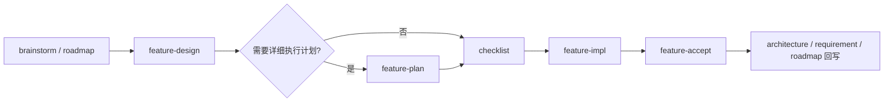

# spec-structure-contract design

## 0. 术语约定

| 术语 | 定义 | 防冲突结论 |
|---|---|---|
| `feature-design` | 单条 feature 的范围、术语、决策、成功标准与流程级约束的唯一方案源 | 仓库现有 `design.md` 已承担此角色；本 feature 保留该定位，不把执行细节塞回 design |
| `feature-plan` | 单条 feature 的分步骤执行说明，承接已批准 design，只展开推进顺序、退出信号与验证路径 | 当前仓库没有这一一等产物；本 feature 先锁定名称与职责，模板和校验留给后续 feature |
| `checklist.yaml` | 机器可读的状态载体，记录 steps/checks 的推进状态 | 现有仓库已把 checklist 当执行清单；本 feature 明确它不是 narrative plan |
| `acceptance.md` | 对照 design / plan / checklist 的验收与回写报告 | 现有仓库已有 acceptance 概念；本 feature 明确它是核验与回写层，不重新定义需求或步骤 |
| legacy feature | 只有 design + checklist + acceptance 的旧式 feature 目录 | 本 feature 保持兼容，不要求历史 feature 回填 `feature-plan` |

## 1. 决策与约束

### 需求摘要

**做什么**：为 NewCodeStable 明确四类 feature 产物的职责边界：`design` 管范围与约束，`feature-plan` 管分步骤执行说明，`checklist` 管状态追踪，`acceptance` 管核验与回写；并把这套边界写入项目共享约定与 feature 流程技能文档。

**为谁**：NewCodeStable 的维护者与使用者。维护者需要稳定的 spec 口径，后续实现 `execution-plan-artifact` 时不再重复争论“哪份文档写什么”；使用者需要在读流程文档时立刻区分“哪份是拍板范围、哪份是执行步骤、哪份是状态表”。

**成功标准**：
1. `.codestable/reference/shared-conventions.md` 明确四类产物的职责边界与 legacy / hybrid 兼容口径。
2. `cs-feat`、`cs-feat-design`、`cs-feat-impl`、`cs-feat-accept` 对这四类产物的描述一致，不再把 checklist 写成 hybrid feature 的详细步骤正文。
3. 新读者只看项目副本文档，就能分清 scope source、step source、status carrier、verification sink。
4. roadmap 起头的 feature 在术语上能容纳 `feature-plan`，但不要求当前仓库立即为历史 feature 回填 plan。

**明确不做**：
- 不在本 feature 中实现 `feature-plan` 模板生成、校验脚本或自动回写逻辑。
- 不批量迁移已有 feature 目录，也不要求历史 feature 补 `{slug}-plan.md`。
- 不修改 issue / refactor 流程的产物结构。
- 不处理多模型协作策略或 `.ccg/` 目录本身。
- 不在本 feature 中决定“所有标准 feature 是否一律强制带 plan”；这里只定义职责边界和兼容规则。

### 复杂度档位

走“项目内部工具”默认档位，仅偏离两项：
- 可读性 = public（偏离默认 team 的原因：这次改动直接修改给用户和下游技能读取的共享契约文档，外部读者需要无背景快速读懂）
- 兼容性 = backward-compatible（偏离默认 current-only 的原因：已有 legacy feature 目录必须继续成立，不能因引入 `feature-plan` 破坏旧流程）

### 关键决策

1. **design 继续做唯一范围源，不吸收执行步骤正文**  
   只要一条信息会改变 feature 的范围、术语、成功标准或流程级约束，它就属于 design；plan 只能展开已拍板 design，不得反向改 scope。

2. **`feature-plan` 先作为一等术语和保留产物落约定，再由后续 feature 落模板与校验**  
   本 feature 的目标是先把边界锁死，避免后续 `execution-plan-artifact` 一边造模板一边还在争论职责。

3. **checklist 是状态投影，不是 narrative plan**  
   checklist 保留机器可读 steps/checks 与状态机职责；对人可读的执行顺序、退出信号解释、验证路径属于 `feature-plan`。

4. **acceptance 的输入从“design + checklist”扩展为“design + plan(若存在) + checklist”**  
   acceptance 不为 plan 缺位的 legacy feature 失败，但 hybrid feature 一旦有 `feature-plan`，它就必须成为验收输入之一。

5. **兼容策略只前向生效，不追溯批改历史 feature**  
   新规范从新 feature 开始采用；历史 feature 保留原样，避免把一次流程升级变成存量文档大迁移。

## 2. 名词与编排

### 2.1 名词层

#### 现状

- 当前 feature 目录契约是 `brainstorm / intent / design / checklist / acceptance`，没有 `feature-plan`。来源：`cs-feat/SKILL.md`、`README.md`、`.codestable/reference/shared-conventions.md`。
- 当前 `checklist.yaml` 被定义为 feature 工作流的唯一执行清单，`steps` 与 `checks` 都围绕它流转。来源：`.codestable/reference/shared-conventions.md` 第 2 节。
- 当前 `cs-feat-design` 把 design 描述为 implement 和 acceptance 的主输入，`cs-feat-accept` 也按 design 章节硬编码核对实现。来源：`cs-feat-design/SKILL.md`、`cs-feat-accept/SKILL.md`。
- roadmap → feature 的衔接已经有 `roadmap` / `roadmap_item` frontmatter 与 items.yaml 状态机，但还没有 plan 层术语。来源：`.codestable/reference/shared-conventions.md` 第 2.5 节。

#### 变化

- 新增一等术语 **`feature-plan`**，文件路径预留为 `.codestable/features/{feature}/{slug}-plan.md`，`doc_type: feature-plan`。
- 重新锁定四类产物职责：
  - `design`：范围、术语、成功标准、约束、挂载点、推进策略切片
  - `feature-plan`：逐步执行说明、退出信号解释、验证路径、风险与缓解
  - `checklist.yaml`：steps/checks 的状态载体
  - `acceptance.md`：核验与回写报告
- 明确 legacy / hybrid 两类 feature：
  - legacy：`design + checklist + acceptance`
  - hybrid：`design + plan + checklist + acceptance`
- 本 feature 只定义这些名词和边界，不要求当前仓库立刻给每条 feature 生成 plan。

#### 接口示例

目录契约示例：

```text
.codestable/features/2026-06-01-demo/
├── demo-design.md
├── demo-plan.md          # 可选：hybrid feature 使用
├── demo-checklist.yaml
└── demo-acceptance.md
```

frontmatter 示例：

```yaml
# 来源：workflow-hybridization roadmap 第 4 节契约草案
feature: 2026-06-01-demo
roadmap: workflow-hybridization
roadmap_item: execution-plan-artifact

# 新增保留术语
# 来源：本 feature 目标契约
---
doc_type: feature-plan
feature: 2026-06-01-demo
design: demo-design.md
status: draft
---
```

### 2.2 编排层



#### 现状

- 当前标准 feature 主流程是 `design → checklist → implement → acceptance`，plan 层缺位。来源：`cs-feat/SKILL.md`、`README.md`。
- implement 按 checklist 的 paradigm steps 推进，acceptance 按 design + checklist 核对。来源：`cs-feat-impl/SKILL.md`、`cs-feat-accept/SKILL.md`。
- design 已承担“推进策略切片”职责，但还没有一份独立的人类可读执行计划去承接复杂 feature 的逐步说明。

#### 变化

- feature 流程的目标编排改为：**design 先拍板范围 → 需要细化执行时产出 plan → checklist 承接状态 → implement 推进 → acceptance 核验并回写**。
- 对 legacy feature 保持现状：没有 `feature-plan` 时仍走 `design → checklist → implement → acceptance`。
- 对 hybrid feature，新 plan 只允许细化 design 已批准的内容，不得引入新 scope；checklist 必须与 plan 的步骤顺序一致。
- acceptance 的核验输入扩为“design 必读，plan 条件必读，checklist 必读”，并据此判断实现、架构回写和 roadmap 回写是否完整。

#### 流程级约束

- **scope ownership**：只有 design 能定义 feature 范围；plan、checklist、acceptance 都不能越权改 scope。
- **step ownership**：对人可读的详细执行步骤属于 `feature-plan`；checklist 只保留机器可读状态。
- **compatibility**：缺 plan 的 legacy feature 仍然有效；只有明确采用 hybrid 口径的新 feature 才要求 plan 参与下游。
- **writeback discipline**：roadmap items.yaml、requirement、architecture 的回写责任仍在 acceptance，不前移到 plan。
- **observability**：用户必须能从技能文档中一眼看出“哪份文档负责什么”，避免下游技能各读各的口径。

### 2.3 挂载点清单

- `.codestable/reference/shared-conventions.md` — 共享产物职责与兼容规则的权威副本（修改）
- `cs-feat/SKILL.md` — feature 流程入口和目录结构说明（修改）
- `cs-feat-design/SKILL.md` — design 阶段输出边界与 plan 衔接口径（修改）
- `cs-feat-impl/SKILL.md` — implement 阶段对 scope source / step source / status source 的消费边界（修改）
- `cs-feat-accept/SKILL.md` — acceptance 阶段验收输入与回写职责口径（修改）

### 2.4 推进策略

1. **共享契约骨架**：先在 shared conventions 里写清四类产物职责与 legacy / hybrid 兼容规则  
   退出信号：共享副本中能直接回答“哪份文档写什么、哪份不该写什么”
2. **入口与设计阶段对齐**：更新 `cs-feat` 与 `cs-feat-design`，让起手路由和 design 输出边界与新契约一致  
   退出信号：入口文档不再把 checklist 误当 hybrid feature 的详细步骤正文
3. **实现与验收阶段对齐**：更新 `cs-feat-impl` 与 `cs-feat-accept` 的消费口径  
   退出信号：下游文档能明确区分 scope source、step source、status carrier、verification sink
4. **读者视图收口**：同步 `system-overview` / `README` 中与 feature 目录和阶段流有关的说明  
   退出信号：外部读者看到的目录结构与阶段说明不再和共享约定冲突
5. **一致性复核**：用 grep 和人工 review 检查 `feature-plan`、legacy、hybrid、checklist 职责等术语是否统一  
   退出信号：同一职责不再被两份不同文档重复或冲突定义

### 2.5 结构健康度与微重构

##### 评估
- 文件级 — `.codestable/reference/shared-conventions.md`：252 行，职责集中在共享口径；本次是补一段新契约，不触发拆分阈值。
- 文件级 — `cs-feat-design/SKILL.md`：246 行，职责集中在 design 阶段；本次只改产物边界与流程说明，不引入第二主题。
- 文件级 — `cs-feat-impl/SKILL.md` / `cs-feat-accept/SKILL.md`：都在单阶段职责内，改动是消费口径校正，不是结构重划。
- 目录级 — `.codestable/reference/`：现有 6 个文件，本次只改旧文件不新增同层文件，不存在摊平问题。
- 目录级 — 仓库根的 `cs-*` 技能目录：虽然数量多，但本 feature 不新增技能目录，只更新既有入口说明。
- compound convention：当前 `.codestable/compound/` 为空，未命中现成目录组织或命名 convention。

##### 结论：不做

本 feature 不做微重构，原因是改动集中在既有共享约定与技能说明的职责澄清，文件和目录都没有达到“只搬不改行为”重构的收益阈值。

##### 超出范围的观察
- `README.md` / `README.en.md` 与项目副本文档重复维护 feature 目录结构；若后续产物继续增多，可能需要单独做一条文档同步或生成式维护的 refactor。本 feature 先不处理。

## 3. 验收契约

- **S1 共享契约可读**：打开 `.codestable/reference/shared-conventions.md`，能直接区分 design、plan、checklist、acceptance 四类产物的职责，且没有“同一职责两份文档都 claiming” 的冲突。
- **S2 入口与设计口径一致**：打开 `cs-feat/SKILL.md` 和 `cs-feat-design/SKILL.md`，能看出 hybrid feature 可以有 `feature-plan`，且 design 仍是范围源，不承担详细执行步骤正文。
- **S3 实现与验收口径一致**：打开 `cs-feat-impl/SKILL.md` 和 `cs-feat-accept/SKILL.md`，能看出 checklist 是状态载体，plan 在存在时是下游输入之一。
- **S4 legacy 兼容成立**：文档明确允许没有 `feature-plan` 的 legacy feature 继续有效，不要求历史目录补 plan。
- **S5 roadmap 衔接不冲突**：roadmap 起头 feature 的 `roadmap` / `roadmap_item` 口径与 `feature-plan` 术语共存，不引入第二套状态机。

**明确不做的反向核对项**：
- 代码库中不应出现“历史 feature 必须补 plan 才合法”的新规则。
- 本 feature 不应引入新的 `.ccg/` 真相源或平行 feature 目录。
- 本 feature 不应把 issue / refactor 流程改写成依赖 `feature-plan`。

## 4. 与项目级架构文档的关系

本 feature 引入的是项目级、系统可见的工作流契约变化，不是某个模块内部重命名。acceptance 阶段应把以下内容提炼回 `ARCHITECTURE.md`：

- **名词**：`feature-plan`、legacy feature、hybrid feature 三个稳定术语
- **动词骨架**：feature 主流程从“design → checklist → implement → acceptance”扩展为“design →（条件存在的）plan → checklist → implement → acceptance”
- **流程级约束**：design 是 scope source、checklist 是 status carrier、acceptance 负责回写，legacy 不做历史回填

当前项目还没有细分架构子文档，因此本 feature 预计只更新 `.codestable/architecture/ARCHITECTURE.md`，不新建 architecture 子文档。
