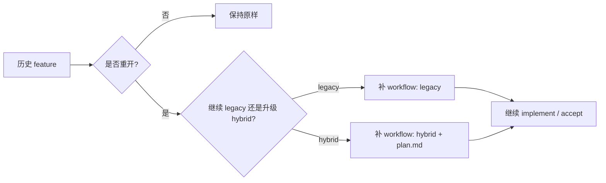

# migration-guidance design

## 0. 术语约定

| 术语 | 定义 | 防冲突结论 |
|---|---|---|
| legacy repository | 已接入 `.codestable/`，但大量历史 feature 仍是 `design + checklist + acceptance` 口径的仓库 | 本 feature 要描述这种仓库如何逐步采用 hybrid，而不是要求一次性补齐历史产物 |
| migration guidance | 一套迁移规则，说明新旧口径如何并存、何时补写、何时跳过 | 本 feature 只做指导与模板，不做批量自动迁移器 |
| forward-only adoption | 新规范只对新 feature 或明确回炉的 feature 生效 | 这是当前体系避免大规模回填的核心策略 |
| historical backfill | 对历史产物做事后补写或状态修复 | 本 feature 明确默认不做，除非用户显式要求或某条 feature 重开 |

## 1. 决策与约束

### 需求摘要

**做什么**：定义 NewCodeStable 里 legacy 仓库与历史 feature 采用 hybrid 工作流的迁移策略，明确：
1. 哪些旧产物保持 legacy 合法状态；
2. 哪些新 feature 必须遵守当前 hybrid 口径；
3. 如果用户要重启一个旧 feature，哪些字段 / 文件要补；
4. acceptance / commit / 后续 roadmap 如何处理迁移中的新旧并存。

**为谁**：维护 NewCodeStable 和使用它的项目 owner。维护者需要避免“看见新规则就逼所有旧产物回填”的高成本误操作；项目 owner 需要清楚什么时候可以继续用旧口径，什么时候必须切到新口径。

**成功标准**：
1. 共享约定中明确 legacy 仓库与历史 feature 的默认处理原则。
2. 至少定义 3 种迁移场景：旧 feature 保持原样、新 feature 直接 hybrid、旧 feature 重开时的最小补写。
3. 设计/实现/验收文档在读历史 feature 时不会误报“缺 plan 就非法”。
4. 用户看到迁移指导后，能判断某个历史 feature 是否需要回填、回填到什么程度。

**明确不做**：
- 不实现批量迁移脚本。
- 不自动扫描并重写历史 feature 目录。
- 不要求所有现有仓库立刻补 `workflow` 字段或 `plan.md`。
- 不处理 issue / refactor 的历史迁移。
- 不做跨仓库迁移控制台或 dashboard。

### 复杂度档位

走“项目内部工具”默认档位，仅偏离两项：
- 可读性 = public（偏离默认 team 的原因：迁移指导是给用户与项目 owner 直接执行的规则）
- 兼容性 = backward-compatible（偏离默认 current-only 的原因：本 feature 的核心就是维持新旧并存而不炸）

### 关键决策

1. **迁移默认前向生效，不追溯回填**  
   新协议默认只约束新 feature；历史 feature 继续按当时口径有效，除非用户显式重开它。

2. **旧 feature 重开时只补最小必要产物**  
   如果某条旧 feature 要继续推进，只补它继续跑流程所需要的字段/文件，不为“整齐”一次补齐所有历史文档。

3. **workflow marker 只对新设计或重开设计要求显式写出**  
   历史 design 没有 `workflow` 字段不算错；从现在开始的新设计和被重开的设计需要显式写 `legacy|hybrid`。

4. **迁移指导是 read-before-act 规则，不是自动修复器**  
   用户先按场景判断，再决定是否让后续 feature/acceptance 去补文档；本 feature 不直接改老数据。

## 2. 名词与编排

### 2.1 名词层

#### 现状

- 共享约定已经定义 `legacy feature`、`hybrid feature`、`plan presence rule`、`feature directory binding`。来源：`.codestable/reference/shared-conventions.md`。
- 当前仓库已有 4 条新 feature，均在新规范之下推进，但还没有一份显式的迁移指导。来源：`.codestable/features/`。
- `workflow` frontmatter 已被引入为机器可读标记，但共享约定尚未明确“旧 design 没这个字段是否算错”。

#### 变化

- 新增 migration guidance 规则，至少覆盖：
  - **旧 feature 保持原样**：历史缺 plan / 缺 workflow marker 不视为非法
  - **新 feature 直接按新规范走**：需要显式 `workflow: legacy|hybrid`
  - **旧 feature 重开**：从重开那一刻起补最小必要字段和产物
- 明确最小必要补写清单：
  - 重开但仍按 legacy：补 `workflow: legacy`（如要继续进入新工具链）
  - 重开并升级 hybrid：补 `workflow: hybrid` + 真实 `plan.md`
  - roadmap 起头的旧 feature 重开：核对 `items.yaml.feature` 与目录名绑定

#### 接口示例

旧 feature 保持原样：

```text
历史目录缺 plan.md、design 没 workflow 字段
→ 合法，不自动改
```

旧 feature 重开并继续 legacy：

```yaml
---
feature: 2025-12-01-old-feature
workflow: legacy
status: approved
---
```

旧 feature 重开并升级 hybrid：

```yaml
---
feature: 2025-12-01-old-feature
workflow: hybrid
status: approved
---
# 同目录必须新增 old-feature-plan.md
```

### 2.2 编排层



#### 现状

- 当前规则已能区分 legacy/hybrid，但缺少“历史产物如何过渡”的专门说明。来源：shared conventions、前几条 feature 设计。
- workflow-check 会越来越严格，因此如果没有迁移指导，用户会不清楚什么时候该补字段、什么时候不用动旧文档。

#### 变化

- 对历史 feature 新增迁移分岔：保持原样 / 重开 legacy / 重开 hybrid。
- workflow-check 的适用边界会被迁移指导约束：默认不对历史未重开的 feature 做强制要求。
- acceptance 和后续 commit 会按迁移场景决定是否需要补 plan、补 workflow marker 或保持不动。

#### 流程级约束

- **forward-only**：不因新规则自动追溯改老 feature。
- **minimal backfill**：重开时只补继续走流程所需的最小产物。
- **explicit marker for new work**：从现在开始的新设计和重开的设计都应显式写 `workflow`。
- **no silent upgrade**：不能偷偷把 legacy feature 当 hybrid；升级 hybrid 必须显式补 `workflow: hybrid` 和真实 `plan.md`。

### 2.3 挂载点清单

- `.codestable/reference/shared-conventions.md`：补 migration guidance 总则与 workflow marker 的迁移适用边界 — 修改
- `.codestable/reference/tools.md`：补 workflow-check 对历史 feature 的适用说明 — 修改
- `cs-feat-design/SKILL.md`：补“旧 feature 重开时如何判断要不要补 workflow / plan” — 修改
- `cs-feat-accept/SKILL.md`：补重开场景下的验收回写说明 — 修改
- `.codestable/features/2026-06-02-migration-guidance/`：新增当前 feature 的 design/checklist（必要时可附简短迁移样例）— 修改

### 2.4 推进策略

1. **迁移总则**：先把 forward-only、minimal backfill、no silent upgrade 写清  
   退出信号：共享约定能独立回答“旧 feature 要不要补文档”
2. **设计阶段入口**：更新 `cs-feat-design/SKILL.md`，说明旧 feature 重开时怎么判断 legacy/hybrid 迁移路径  
   退出信号：design 阶段能明确告诉用户“原样保持 / 最小补写 / 升级 hybrid”三条路
3. **验收与工具边界**：更新 acceptance / tools 说明，让 workflow-check 不误伤未重开的历史 feature  
   退出信号：新旧并存边界清楚，不会把历史目录都打成错误
4. **样例自证**：用文字样例把三种迁移路径写清，确认人工可执行  
   退出信号：用户看到样例能判断自己的 feature 属于哪类

### 2.5 结构健康度与微重构

##### 评估
- 文件级 — `.codestable/reference/shared-conventions.md`：继续承载共享工作流规则，本次是迁移边界补充。
- 文件级 — `cs-feat-design/SKILL.md` / `cs-feat-accept/SKILL.md`：都是阶段协议说明的自然延伸。
- 文件级 — `.codestable/reference/tools.md`：补校验器适用边界属同主题延伸。
- 目录级 — 当前 feature 目录新增 design/checklist 即可，规模健康。
- compound convention：当前 compound 为空，未命中可复用 convention。

##### 结论：不做

本 feature 不做微重构，原因是改动集中在迁移策略说明，不涉及结构拆分。

## 3. 验收契约

- **S1**：共享约定能回答历史 feature 默认是否需要补 plan / workflow marker。
- **S2**：`cs-feat-design` 能在旧 feature 重开时给出明确迁移路径。
- **S3**：workflow-check 的适用边界对历史未重开的 feature 足够清晰，不会误伤。
- **S4**：重开 legacy 与重开 hybrid 的最小补写清单明确。
- **S5**：迁移指导样例足够让用户人工判断自己属于哪条路径。

**明确不做的反向核对项**：
- 不应要求所有历史 feature 立即补 `workflow` 或 `plan.md`。
- 不应引入批量迁移脚本。
- 不应把历史缺字段直接视为错误。

## 4. 与项目级架构文档的关系

本 feature 会把“新旧工作流并存时如何迁移”提炼回 `ARCHITECTURE.md`：

- **名词**：legacy repository / forward-only adoption / minimal backfill
- **动词骨架**：历史 feature 保持原样，重开时再选择 legacy/hybrid 路径
- **流程级约束**：不能静默升级 hybrid，workflow-check 不应误伤未重开的历史产物
