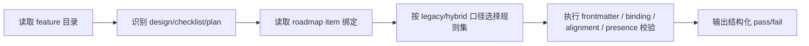

# plan-validation-rules design

## 0. 术语约定

| 术语 | 定义 | 防冲突结论 |
|---|---|---|
| validation rule | 一条可自动判定通过/失败的协议检查规则 | 本 feature 的目标是把 handoff 约束从“口头规约”变成工具可检查规则 |
| plan/checklist alignment | `{slug}-plan.md` 的步骤与 `{slug}-checklist.yaml` 的 `steps` 在数量、顺序、目标语义上的一致性 | 现有共享约定要求二者对齐，但目前只能靠人工阅读发现偏差 |
| roadmap binding check | items.yaml、design frontmatter、plan frontmatter、feature 目录名之间的绑定关系校验 | 本 feature 会把它落进校验脚本，不再只靠 acceptance 人工核对 |
| workflow marker | design frontmatter 里的 `workflow: legacy|hybrid` 标记 | 校验器需要一个机器可读信号来判断 plan 缺失是否应视为错误；缺省按 `legacy` 处理 |

## 1. 决策与约束

### 需求摘要

**做什么**：扩展当前 `.codestable/tools/validate-yaml.py` 或新增同类校验能力，让以下约束能被自动检查：
1. hybrid feature 若存在 `plan.md`，其 frontmatter 字段合法；
2. plan 与 checklist 的步骤映射关系一致；
3. roadmap items.yaml 与 design / plan / feature 目录名绑定一致；
4. roadmap item 状态、plan presence rule 与 legacy / hybrid 口径之间无冲突。

**为谁**：NewCodeStable 的维护者与使用者。维护者需要在实现前或验收前快速发现“plan 缺失、绑定错、步骤不对齐”这类协议错误；使用者需要更少依赖人工 diff 去判断流程产物是否自洽。

**成功标准**：
1. 至少有一个可执行校验入口能检查 plan/checklist/roadmap 绑定关系。
2. 校验输出能明确指出哪条规则失败、失败文件是什么。
3. legacy feature 不会因没有 `plan.md` 被误报失败。
4. hybrid feature 缺 plan、plan/checklist 步骤不一致、items.yaml 绑定不一致时会报错。

**明确不做**：
- 不做 IDE 插件、浏览器界面或实时文件监听。
- 不在本 feature 中重写整个 `.codestable/tools/` 工具栈；优先小步扩展现有校验器或新增相邻脚本。
- 不对历史 feature 批量修复校验错误；本 feature 只负责发现问题。
- 不处理 issue / refactor 的文档校验。

### 复杂度档位

走“项目内部工具”默认档位，仅偏离两项：
- 健壮性 = L3（偏离默认 L2 的原因：这是工具链的协议检查入口，误判/漏判会直接影响后续流程可靠性）
- 可测试性 = tested（偏离默认 testable 的原因：至少要用真实样板验证通过/失败路径）

### 关键决策

1. **优先复用现有 `validate-yaml.py`，只在职责明显越界时再拆新脚本**  
   目前仓库已有统一 YAML 校验入口，扩展其模式比平行再造一个“validate-plan.py”更容易被接受和复用。

2. **规则按口径分层，不按文件分层**  
   校验规则应该围绕“frontmatter 合法”“绑定一致”“步骤对齐”“presence rule”这些协议层语义，而不是散落成每个文件各自的 ad-hoc 检查。

3. **legacy feature 默认通过，hybrid feature 严格检查**  
   校验器必须知道何时不该期待 `plan.md`，否则会把兼容策略反向破坏掉。

4. **输出必须适合 AI agent 消费**  
   每条失败都要能回答：哪条规则、哪个文件、为什么失败；不能只给“校验失败”这种黑盒结论。

## 2. 名词与编排

### 2.1 名词层

#### 现状

- 当前 `.codestable/tools/validate-yaml.py` 只做 YAML/frontmatter 语法与必填字段校验，不理解 plan/checklist/roadmap 的跨文件协议。来源：`.codestable/tools/validate-yaml.py`。
- 当前 shared conventions 已定义 `plan presence rule`、`feature directory binding`、`items.yaml` 状态机、plan/checklist 关系，但这些都是文档约束。来源：`.codestable/reference/shared-conventions.md`。
- 仓库里已有真实 hybrid 样板：`2026-06-01-execution-plan-artifact`，可用于校验真实通过路径。来源：`.codestable/features/2026-06-01-execution-plan-artifact/`。

#### 变化

- 新增或扩展校验模式，至少覆盖：
  - **design workflow rule**：design frontmatter 的 `workflow` 若存在，只允许 `legacy|hybrid`
  - **plan frontmatter rule**：`doc_type / feature / design / status` 合法
  - **binding rule**：`design.feature = items.feature`；hybrid 时 `plan.feature = design.feature`
  - **presence rule**：`workflow: hybrid` 时必须存在 `plan.md`；legacy feature 可无 `plan.md`
  - **step alignment rule**：plan step 数量与 checklist step 数量一致，映射顺序可核对
- 校验输出新增规则名、文件路径、错误原因三个维度。

#### 接口示例

建议入口示例：

```bash
python .codestable/tools/validate-yaml.py \
  --feature-dir .codestable/features/2026-06-01-execution-plan-artifact \
  --roadmap .codestable/roadmap/workflow-hybridization/workflow-hybridization-items.yaml \
  --workflow-check
```

失败输出示例：

```text
✗ RULE: plan_presence
  feature: 2026-06-02-sample
  file: .codestable/features/2026-06-02-sample/sample-design.md
  error: design implies hybrid workflow but sample-plan.md is missing
```

### 2.2 编排层



#### 现状

- 校验流目前只在文件级停留：给一个 YAML 或 markdown frontmatter，判断能否 parse。来源：`.codestable/tools/validate-yaml.py`。
- roadmap / design / plan / checklist 的跨文件校验仍依赖人工 review 和 acceptance。来源：前两条 feature 的 design / acceptance 结果。

#### 变化

- 校验流升级为“文件语法 + 协议语义”双层：先确保 parse 成功，再检查跨文件绑定、自定义状态机和 step 对齐。
- 工具先识别当前 feature 是 legacy 还是 hybrid，再决定是否期待 `plan.md`。
- 工具输出变为规则级诊断，供 implement / acceptance / pre-commit 场景复用。

#### 流程级约束

- **backward-compatible**：legacy feature 无 `plan.md` 不得报错。
- **strict for hybrid**：hybrid feature 缺 plan、绑定不一致、步骤不对齐必须报错。
- **read-only validation**：工具只报告问题，不自动修改文档。
- **deterministic**：同样输入反复执行输出一致。

### 2.3 挂载点清单

- `.codestable/tools/validate-yaml.py`：新增 workflow-check 模式或等价扩展 — 修改
- `.codestable/reference/tools.md`：补充新校验入口和用法 — 修改
- `.codestable/reference/shared-conventions.md`：补充“哪些规则应被校验器理解”的一行说明 — 修改
- `.codestable/features/2026-06-02-plan-validation-rules/`：新增当前 feature 的 design/checklist（以及如需要的测试样板）— 修改
- 真实样板 feature（优先 `2026-06-01-execution-plan-artifact/`）— 作为通过路径样例参与验证，不新增新状态字段

### 2.4 推进策略

1. **校验器能力边界**：先确定是在现有 `validate-yaml.py` 扩展，还是拆出新的 workflow-check 模式  
   退出信号：工具入口和规则层级已拍板
2. **绑定与存在性规则**：实现 plan presence 与 roadmap/design/plan/checklist 绑定校验  
   退出信号：hybrid 缺 plan、绑定错能稳定报错
3. **步骤对齐规则**：实现 plan ↔ checklist steps 对齐校验  
   退出信号：数量/顺序不一致时能稳定报错
4. **用法落盘**：更新 tools 文档和共享约定说明  
   退出信号：用户知道什么时候、怎么调用这条校验能力
5. **样板自证**：用现有通过样板和至少一个故障样板验证规则  
   退出信号：通过/失败两条路径都有可观察证据

### 2.5 结构健康度与微重构

##### 评估
- 文件级 — `.codestable/tools/validate-yaml.py`：当前已承担 YAML/frontmatter 校验职责，扩展到 workflow contract 校验仍是同一“校验器”主题。
- 文件级 — `.codestable/reference/tools.md`：本就承载工具说明，新增 workflow-check 用法属自然延伸。
- 目录级 — `.codestable/tools/`：当前只有 2 个脚本，未摊平。
- compound convention：当前 compound 为空，未命中可复用工具命名 convention。

##### 结论：不做

本 feature 不做微重构，原因是现有工具与参考目录都较轻，直接扩展更符合最小改动原则。

## 3. 验收契约

- **S1**：校验器能区分 legacy / hybrid，不会把 legacy feature 缺 plan 误报为错误。
- **S2**：hybrid feature 缺 `plan.md` 时，校验器能给出明确失败信息。
- **S3**：design / plan / checklist / roadmap item 绑定不一致时，校验器能指出具体文件和规则名。
- **S4**：plan step 与 checklist step 不一致时，校验器能指出对齐失败。
- **S5**：现有真实样板 feature 能通过新规则校验。

**明确不做的反向核对项**：
- 不应自动改写文档。
- 不应把 legacy feature 一律打成失败。
- 不应引入新的状态字段来配合校验器工作。

## 4. 与项目级架构文档的关系

本 feature 会把“工作流校验器理解哪些协议”提炼回 `ARCHITECTURE.md`：

- **名词**：workflow-check / validation rule / binding rule
- **动词骨架**：从“人工 review 协议一致性”升级到“工具先做一致性预检查”
- **流程级约束**：legacy 兼容、hybrid 严格、校验器只报告不改写
