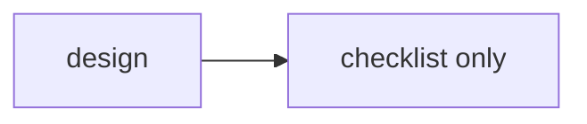

# validation-failure-sample design

## 0. 术语约定

## 1. 决策与约束

### 需求摘要

故障样板，只用于验证 workflow-check 的失败路径。

### 复杂度档位

走默认档位。

### 关键决策

1. 故意缺少 plan。

## 2. 名词与编排

### 2.1 名词层

#### 现状

无。

#### 变化

故意只保留 design/checklist。

### 2.2 编排层

#### 现状

无。

#### 变化

故意制造 hybrid 缺 plan 的错误。

#### 流程级约束

无。

### 2.3 挂载点清单

- `.codestable/features/2026-06-02-validation-failure-sample/`：故障样板目录 — 新增

### 2.4 推进策略

1. 只用于验证失败路径。
   退出信号：workflow-check 报出 plan_presence 错误

### 2.5 结构健康度与微重构

##### 评估
- 文件级与目录级都健康。

##### 结论：不做

## 3. 验收契约

- workflow-check 必须报错。

## 4. 与项目级架构文档的关系

无系统级变化。