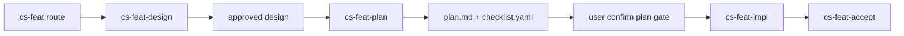

# feature-plan-stage design

## 0. 术语约定

| 术语 | 定义 | 防冲突结论 |
|---|---|---|
| `cs-feat-plan` | 位于 `cs-feat-design` 与 `cs-feat-impl` 之间的显式阶段/skill，负责从已批准 design 生成 `plan.md` 与 `checklist.yaml` | 当前仓库尚无该 skill，本 feature 负责把它变成真实阶段 |
| plan gate | 进入实现前必须经过的执行计划确认关口 | 它不是新的 scope 决策点，只确认执行顺序与退出信号 |
| standard feature path | 除 fastforward 外，标准 feature 的默认主线 | 本 feature 把它固定为 `design → plan → impl → accept` |
| legacy removal | 从活跃 workflow 定义中删除 `design + checklist + acceptance` 这条旧口径 | 历史目录可保留为留档，但不再作为新 feature 或重开 feature 的合法主线 |

## 1. 决策与约束

### 需求摘要

**做什么**：把 CodeStable 的标准 feature 流程从当前用户可见的 `cs-feat → cs-feat-design → cs-feat-impl → cs-feat-accept`，演进为显式的 `cs-feat → cs-feat-design → cs-feat-plan → cs-feat-impl → cs-feat-accept`，并同步删除 legacy 口径，只保留：
1. **fastforward**：小需求快路径
2. **hybrid**：标准 feature 默认主线

其中：
- `cs-feat-design` 只负责起草并批准 `design.md`，描述整体方案、范围、约束与验收契约
- `cs-feat-plan` 专门负责从已批准 design 生成真实 `plan.md` 与 `checklist.yaml`，其中 `plan.md` 要细化到每个文件的改动计划
- `cs-feat-impl` 只在 `design + plan + checklist` 已齐备后才能启动

**为谁**：NewCodeStable 的维护者、使用 feature 工作流的用户，以及后续需要理解或维护 hybrid 机制的技能作者。维护者需要更清晰的阶段职责边界；用户需要在顶层链路上看见 plan 生成与确认关口；技能作者需要单独承载 plan 生成逻辑，而不是继续把它藏在 design 阶段尾部。

**成功标准**：
1. `cs-feat` 顶层阶段表与路由规则能显式把 `plan` 阶段展示给用户。
2. `cs-feat-design` 不再承担生成 `plan.md` / `checklist.yaml` 的落盘职责，只输出已批准 design 并引导进入 `cs-feat-plan`。
3. 新增真实 `cs-feat-plan` skill，负责生成 `plan.md` 与 `checklist.yaml`，并在进入 impl 前形成单独用户 checkpoint。
4. `plan.md` 必须以文件级改动计划组织，明确每一步具体改哪些文件、为什么改、如何验证，不再停留在抽象步骤标题层面。
5. `cs-feat-impl` 的标准输入固定为 `design + plan + checklist`。
6. 活跃 workflow 定义中不再把 legacy 作为合法标准口径；新 feature 只剩 fastforward 与 hybrid 两条路径。

**明确不做**：
- 不在本 feature 中重写 issue / refactor 流程。
- 不批量为历史 feature 回填 `plan.md`。
- 不把 `plan` 变成第二份 scope source；范围与约束仍只由 `design.md` 决定。
- 不在本 feature 中实现新的 UI 或外部可视化编辑器。
- 不把 fastforward 改造成强制经过 `cs-feat-plan`。

### 复杂度档位

走“项目内部工具”默认档位，仅偏离两项：
- 可读性 = public（偏离默认 team 的原因：这是对外暴露给用户的 workflow 阶段变更）
- 迁移敏感度 = high（偏离默认 current-only 的原因：要从活跃定义中删除 legacy，同时保留历史目录只读留档）

### 关键决策

1. **`cs-feat-plan` 适用于所有标准 feature，不只 hybrid 样板 feature**  
   新标准主线下，凡是非 fastforward 的标准 feature，都显式经过 plan 阶段；plan 阶段成为进入 impl 的默认前置关口。

2. **`checklist.yaml` 的生成职责从 design 移到 plan 阶段**  
   设计阶段只做 scope 与约束确认；执行计划与 machine-readable 状态载体一起从已批准 design 派生，避免“design 已通过，但 plan/checklist 仍藏在 design 阶段尾部”的认知混乱。

3. **`plan.md` 的意义是文件级改动计划，不是更长的 design 摘要**  
   design 只回答“做什么 / 为什么这样做 / 范围到哪”；plan 必须进一步回答“具体改哪些文件 / 每个文件承担什么改动 / 改完如何验证”。这也是 `cs-feat-plan` 独立存在的主要价值。

4. **`cs-feat-plan` 是独立 checkpoint，不是 design 的尾巴**  
   用户必须先 review design，再单独确认 plan，之后才进入 impl。这样可以把“做什么”和“按什么顺序做、每个文件怎么改”分成两个不同的人类把关点。

5. **legacy 从活跃 workflow 定义中删除**  
   当前项目方向已经转向 hybrid/default-plan 主线；历史 legacy 目录可以保留为留档，但新 feature 与重开 feature 不再允许沿用 `design + checklist + acceptance` 作为合法主线。

## 2. 名词与编排

### 2.1 名词层

#### 现状

- `cs-feat` 当前对用户暴露的是四阶段主线：brainstorm（可选）→ design → impl → accept。来源：`cs-feat/SKILL.md`。
- `cs-feat-design` 当前在用户 review 通过后，同时负责 hybrid 下的 `plan.md` 与 `checklist.yaml` 生成。来源：`cs-feat-design/SKILL.md` 与 `reference.md`。
- `shared-conventions` 当前定义的标准口径仍是：legacy = `design + checklist + acceptance`，hybrid = `design + plan + checklist + acceptance`，并说明 checklist 由 design 阶段生成。来源：`.codestable/reference/shared-conventions.md`。
- `cs-feat-impl` 当前已把 `plan.md` 当作真实输入，但它是被 design 阶段隐式生成的，不是单独阶段产物。来源：`cs-feat-impl/SKILL.md`。

#### 变化

- 新增显式 skill / 阶段：`cs-feat-plan`。
- 标准 feature 主线变化为：`design → plan → impl → accept`；其中 plan 负责两份真实产物：
  - `{slug}-plan.md`
  - `{slug}-checklist.yaml`
- `cs-feat-design` 变成**只产 design** 的阶段：批准后引导用户进入 `cs-feat-plan`。
- `cs-feat-plan` 变成**只产执行输入**的阶段：读取 approved design，生成 plan 与 checklist，等待用户确认后再进入 impl。
- `plan.md` 的正文粒度从“抽象步骤说明”提升为“文件级改动计划”：每一步都应说明触碰哪些文件、为什么改这些文件、改完看什么证据。
- `cs-feat-impl` 的启动前提显式改成：`design.md` 已 approved + `plan.md` 存在 + `checklist.yaml` 存在。
- legacy 从活跃 workflow 口径中删除；历史 legacy 目录只作为历史留档存在，不再被 `cs-feat` 路由为标准实现路径。

#### 接口示例

标准 feature 用户可见链路目标形态：

```text
cs-feat
  └─ 路由到 cs-feat-design
       └─ 产出 {slug}-design.md（approved）
            └─ 路由到 cs-feat-plan
                 ├─ 产出 {slug}-plan.md
                 └─ 产出 {slug}-checklist.yaml
                      └─ 路由到 cs-feat-impl
                           └─ 路由到 cs-feat-accept
```

### 2.2 编排层



#### 现状

- 设计阶段既承担 scope 设计，又承担 plan/checklist 生成，导致用户在顶层链路上看不见 plan 生成关口。
- `cs-feat` 的路由判断当前是“design 已 approved 且 plan/checklist 已齐 → impl”，但 plan 的生成仍然被藏在 design 内部。
- 对使用者来说，“design 通过”和“执行准备就绪”两个动作被压成了一个阶段。
- legacy 仍被写成活跃口径之一，和当前“新 feature 默认往 hybrid 收敛”的方向存在冲突。

#### 变化

- 把“方案批准”和“执行计划生成”拆成两个连续 checkpoint：
  1. `cs-feat-design`：确认范围、约束、验收契约
  2. `cs-feat-plan`：确认执行顺序、退出信号、checklist 派生
- `cs-feat` 顶层路由要能区分：
  - approved design 但还没进入 plan 阶段
  - plan/checklist 已齐、可以进入 impl
- `cs-feat-plan` 成为标准主线的唯一 plan 生成入口，不再允许由 design 阶段直接越权生成 checklist。
- legacy 从主线中移除；顶层路由只保留 fastforward 与 standard hybrid 两类 feature 入口。

#### 流程级约束

- **scope / step / status 三分口径继续成立**：design = scope source，plan = step source，checklist = status carrier。
- **plan gate 显式化**：进入 impl 前必须有用户对 plan 的单独确认。
- **legacy removal**：历史 legacy 目录可保留，但不再允许作为新 feature 或重开 feature 的合法主线。
- **fastforward 豁免**：快路径仍允许跳过 design/plan/accept 的标准 spec 链。

### 2.3 挂载点清单

- `cs-feat/SKILL.md`：阶段表与路由规则新增 `cs-feat-plan`，并移除 legacy 作为活跃标准口径 — 修改
- `cs-feat-design/SKILL.md`：去掉 plan/checklist 落盘职责，改为设计完成后引导进入 `cs-feat-plan` — 修改
- `cs-feat-plan/SKILL.md`：新增独立 skill，承接 plan/checklist 生成与单独确认 — 新增
- `cs-feat-plan/reference.md`：新增 plan/checklist 模板，明确 plan 以文件级改动计划组织 — 新增
- `cs-feat-design/reference.md`：plan/checklist 模板与提取规则从 design 阶段职责改为 plan 阶段职责 — 修改
- `.codestable/reference/shared-conventions.md`：删除 legacy 作为活跃口径的定义，更新标准 feature 的阶段职责与 checklist 生成责任 — 修改
- `.codestable/reference/system-overview.md` / `.codestable/architecture/ARCHITECTURE.md`：更新 feature 主线与长期方向摘要 — 修改
- `cs-feat-impl/SKILL.md`：启动前提更新为读取 design + plan + checklist — 修改
- `cs-feat-accept/SKILL.md`：验收输入继续是 design + plan + checklist，但上游阶段来源改为 `cs-feat-plan` — 修改

### 2.4 推进策略

1. **顶层路由改造**：先更新 `cs-feat` 阶段表和路由规则，让用户在入口就能看到 `cs-feat-plan`，并不再把 legacy 当作活跃标准口径。  
   退出信号：顶层链路已变成 `design → plan → impl → accept`，且只有 fastforward 与 hybrid 两类路径。
2. **职责切分**：更新 `cs-feat-design`，让 design 阶段停止落 plan/checklist，并在 approved 后引导去 `cs-feat-plan`。  
   退出信号：design 阶段只产 approved design。
3. **新阶段落地**：新增 `cs-feat-plan` skill，负责从 design 生成 plan + checklist，并形成单独用户确认关口。  
   退出信号：存在真实 `cs-feat-plan/SKILL.md`，且 feature 目录能通过它生成两份产物。
4. **文件级计划模板**：更新 `cs-feat-plan` 的模板与说明，使 `plan.md` 细化到每个文件的改动计划，而不是只写高层抽象步骤。  
   退出信号：plan 模板能清楚表达“文件 → 改动目的 → 验证方式”。
5. **共享口径回写**：更新 shared conventions、system overview、architecture，让默认主线与 legacy 删除后的边界说法一致。  
   退出信号：文档层不再把 legacy 写成活跃标准 feature 口径，也不再把 plan 生成功能说成 design 阶段内部动作。
6. **下游对齐**：同步 impl / accept 的输入说明。  
   退出信号：impl / accept 只消费 design + plan + checklist，不再假设 checklist 来自 design 阶段。

### 2.5 结构健康度与微重构

##### 评估
- 文件级 — `cs-feat/SKILL.md`、`cs-feat-design/SKILL.md`、`cs-feat-impl/SKILL.md`、`cs-feat-accept/SKILL.md`：都是既有 workflow skill，当前改动属于职责切分，不涉及第二主题混入。
- 文件级 — `.codestable/reference/shared-conventions.md`：已有 feature 产物职责边界，本次是在既有主题下删除 legacy 活跃口径并新增 plan 阶段职责。
- 目录级 — 仓库根目录已有一组 `cs-feat-*` skill，新增 `cs-feat-plan/` 与现有命名簇一致，目录未摊平到需要重组。
- compound convention：当前 decision 已有关于 workflow 顶层关口、hybrid 默认方向的沉淀，可直接复用，不需新增目录归属 convention。

##### 结论：不做

本 feature 不做微重构，原因是主要工作是新增一个同簇 skill 并改既有阶段职责说明，目录与文件职责当前仍健康。

## 3. 验收契约

- **S1**：`cs-feat` 的阶段表和路由规则能显式暴露 `cs-feat-plan` 这个新阶段。
- **S2**：`cs-feat-design` 在 approved 后不再直接生成 plan/checklist，而是把用户引导到 `cs-feat-plan`。
- **S3**：仓库中存在真实 `cs-feat-plan` skill，能从已批准 design 生成 `plan.md` 与 `checklist.yaml`。
- **S4**：`plan.md` 模板与实际产物都以文件级改动计划组织，而不是重复 design 的高层摘要。
- **S5**：`shared-conventions` 已把 checklist 生成责任从 design 阶段改写为 plan 阶段，并删除 legacy 作为活跃标准口径。
- **S6**：`cs-feat-impl` 只有在 design + plan + checklist 已齐时才启动；fastforward 路径不受影响。

**明确不做的反向核对项**：
- 不应让 plan 重新成为 scope source。
- 不应要求历史 legacy feature 立即批量回填 `plan.md`。
- 不应让 fastforward 也强制经过 `cs-feat-plan`。

## 4. 与项目级架构文档的关系

本 feature 完成后，architecture 至少要知道：
- feature 主线已从“design 内部顺带生 plan”升级为显式的 `design → plan → impl → accept`
- `cs-feat-plan` 是 workflow 层的一等阶段，不是 `cs-feat-design` 的尾部子动作
- `plan.md` 的职责是文件级改动计划，design 继续只负责整体方案与约束
- 活跃标准 feature 口径只保留 fastforward 与 hybrid，legacy 退出主线定义
