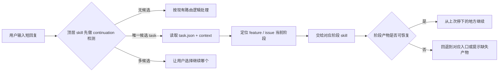

# skill-continuation-first design

## 0. 术语约定

| 术语 | 定义 | 防冲突结论 |
|---|---|---|
| continuation-first | 用户输入短回复时，先判断是否在继续已有流程，再决定是否重新路由 | 仓库内尚无同名共享术语，本 feature 正式引入 |
| 短回复 | `继续 / 确认 / 同意 / 按这个修 / 跳过 / 继续下一步` 这类不携带完整新需求的输入 | 与“开放式新诉求”明确区分 |
| 顶层 skill | 负责开放式入口和路由判断的 skill，如 `cs`、`cs-feat`、`cs-issue` | 不等同于阶段执行 skill |
| 阶段 skill | 负责 design / plan / impl / accept 或 report / analyze / fix 的 skill | 现有仓库已经大量使用这个分层 |
| task 状态桥 | 项目内 skills 在检测 continuation 时参考的状态载体，如 `.ccg/tasks/*/task.json` 与现有 spec 产物状态 | 只作续作恢复桥，不成为第二套 workflow 真相源 |

## 1. 决策与约束

### 1.1 需求摘要

- **做什么**：
  1. 只在本项目仓库内优化 skill 协作流程，不改全局 `~/.claude/commands/*`。
  2. 为顶层 skill 和阶段 skill 增加 continuation-first 规则：用户输入短回复时，优先恢复已有 task / spec 阶段状态，而不是重新做路由判断。
  3. 收口 `.ccg/tasks/*/task.json` 与 `.codestable/features/`、`.codestable/issues/` 现有产物之间的职责边界。
  4. 把 continuation-first 的详细共享协议从已超长的 `.codestable/reference/shared-conventions.md` 拆到独立 reference 文件（如 `workflow-continuation.md`），并保留摘要指针。
  5. 同步更新仓库内 skill 文档、共享约定、维护者说明与开发文档，避免不同 skill 对“继续”语义理解不一致。

- **为谁**：
  为使用本仓库 skills 推进 feature / issue 流程的人。目标是让用户在流程中输入简短回复时，系统表现得像“继续同一个任务”，而不是像“每次重新从入口开始”。

- **成功标准**：
  1. `cs`、`cs-feat`、`cs-issue` 这类顶层入口能识别短回复，并优先走 continuation-first。
  2. `cs-feat-design / plan / impl / accept` 与 `cs-issue-report / analyze / fix` 的文档说明中，续作恢复逻辑一致。
  3. 项目共享文档明确：`.ccg/tasks/*/task.json` 只作续作恢复桥，不替代 design / plan / checklist / acceptance 这些既有真相源。
  4. continuation-first 的详细协议落在独立 reference 文件中，`shared-conventions.md` 只保留摘要与指针，且两份文档都不超过 300 行。
  5. 用户在已有 in-progress task 场景下输入短回复，不会再被重复导向同一个入口路由结论。
  6. 没有 in-progress task 时，技能仍保持现有路由行为，不凭空猜测“继续哪一个”。

- **明确不做**：
  - 不修改全局 `/ccg:go` 命令或 `~/.claude/commands/*`。
  - 不把 `.ccg/tasks/` 提升为本项目主 workflow 真相源。
  - 不引入新的外部服务、数据库或浏览器状态。
  - 不批量重写所有历史 feature / issue 文档，只补后续续作真正依赖的共享口径。
  - 不为了拆文档而重组整个 `.codestable/reference/` 目录结构；本次只做最小必要拆分。
  - 不把短回复识别做成无限泛化的自然语言分类器；只覆盖明确列出的 continuation 信号与同类极短确认语句.

### 1.2 复杂度档位

走项目内部工具默认档位，无偏离。

### 1.3 关键决策

1. **只优化仓库内 skill，不碰全局命令层**  
   原因：用户已明确限制范围；本 feature 只收口项目内 skills 的协作语义。

2. **continuation-first 先于 rerouting，但只在“唯一候选续作”时生效**  
   原因：若同时存在多个 in-progress task 或多个相关 feature / issue 目录，继续猜测会制造新的错路由。

3. **`.ccg/tasks/*/task.json` 是续作恢复桥，不是第二套 workflow 真相源**  
   原因：本仓库已有 `.codestable/features/`、`.codestable/issues/` 的阶段产物与状态；task 文件只能帮助入口快速恢复上下文，不能与 spec 状态并列拍板流程事实。

4. **continuation-first 共享协议拆到独立 reference 文件，`shared-conventions.md` 只保留摘要与指针**  
   原因：项目约束要求单个 md 不超过 300 行，而当前 `shared-conventions.md` 已经超长；继续把详细协议堆进去会直接违反项目规则。

5. **顶层 skill 与阶段 skill 都要补 continuation 规则，但职责不同**  
   原因：只有顶层 skill 识别短回复还不够；阶段 skill 也要先检查“是否从上次停下的地方继续”，否则仍会重复输出阶段结论或确认提示。

6. **feature 与 issue 两条主线都纳入范围**  
   原因：短回复样例里既有 `继续 / 同意 / 跳过`，也有明显偏 issue 流程的 `按这个修`。

### 1.4 被拒方案

- **方案 A：只改 `cs`，不改阶段 skill**  
  被拒原因：外层入口不重复路由后，阶段 skill 仍可能继续重复输出“下一步建议”或重新确认 gate。

- **方案 B：把 `.ccg/tasks/` 变成项目内唯一状态机**  
  被拒原因：这会和 `.codestable/features/`、`.codestable/issues/` 现有产物形成双真相源。

- **方案 C：没有唯一候选时也默认选最近一个 task 继续**  
  被拒原因：错续作的代价比多问一句更高。

## 2. 名词与编排

### 2.1 名词层

#### 现状

- `cs/SKILL.md` 当前仍是纯路由入口，结束语固定是“建议走 `cs-xxx` … 现在切到 `cs-xxx` 吗？”。
- `cs-feat/SKILL.md` 当前只按 feature 产物状态路由 design / plan / impl / accept，没有短回复优先恢复的规则。
- `cs-feat-design/SKILL.md`、`cs-feat-impl/SKILL.md`、`cs-feat-accept/SKILL.md` 已各自要求“断点恢复”，但依据主要是 feature 目录里的 design/checklist/acceptance 文件，不包含 task 状态桥。
- `.codestable/reference/maintainer-notes.md` 已定义“断点恢复”，但只覆盖 design / implement / acceptance 等阶段产物，不覆盖顶层短回复与 task 文件衔接。
- `.codestable/reference/shared-conventions.md` 当前已有 300+ 行，若再继续把 continuation-first 详细协议写进去，会违反项目的单文档长度约束。

#### 变化

##### 实体 1：短回复 continuation 信号
- **位置**：`cs/SKILL.md`、`cs-feat/SKILL.md`、`cs-issue` 系列 skill 与共享约定。
- **职责**：标记一类输入应优先触发续作恢复，而不是新任务路由。
- **变化点**：从“所有输入都先按新诉求理解”切换为“短回复先做续作检测”。

示例：

```text
输入：继续
输出：先检查是否存在唯一 in-progress task / 可恢复阶段；命中则从该阶段继续
```

##### 实体 2：task 状态桥
- **位置**：项目内 `.ccg/tasks/*/task.json` 与 `context.jsonl` 的使用约定。
- **职责**：给顶层 skill 一个恢复上下文的快速索引。
- **变化点**：从“项目 skills 不声明如何消费 task 文件”切换为“只有 continuation-first 场景才读取 task 文件，而且只作桥接”。

##### 实体 3：workflow-continuation reference
- **位置**：新增 `.codestable/reference/workflow-continuation.md`。
- **职责**：承载 continuation-first 的详细共享协议、短回复词表、唯一候选约束和 task 状态桥边界。
- **变化点**：从“把协议继续塞进 shared-conventions”切换为“详细协议独立成文，shared-conventions 只保留摘要与指针”。

##### 实体 4：唯一候选续作
- **位置**：顶层 skill 的路由判断。
- **职责**：限定 continuation-first 的安全触发边界。
- **变化点**：新增规则——只有唯一候选时才自动继续；多个候选时停下来让用户选。

### 2.2 编排层



#### 现状

- 顶层 skill 主要做开放式分诊，不区分“短回复 continuation”和“新诉求”。
- 阶段 skill 各自有恢复规则，但缺少统一的 task 文件桥接语义。
- 结果是同一个流程里，顶层和阶段层可能先后重复给出路由结论或重复要求确认。

#### 变化

- 顶层入口先判断 continuation，再决定是否路由。
- 命中 continuation 后，不再重新输出“你这个诉求建议走 …”；而是直接恢复到对应阶段。
- 阶段 skill 的续作检查扩展为“双通道”：
  1. 现有 spec 产物状态恢复
  2. task 状态桥辅助定位
- continuation-first 的详细协议从超长的 `shared-conventions.md` 中拆出，集中落到独立 reference 文件；`shared-conventions.md` 只保留摘要入口。
- 多候选续作时不继续猜，而是停下来让用户选。

#### 流程级约束

- **唯一候选约束**：只有唯一候选续作时才允许自动继续。
- **真相源约束**：feature / issue 真相源仍是 `.codestable/` 产物，task 文件只作恢复索引。
- **边界约束**：项目 skills 只优化仓库内流程，不扩展到全局命令层。
- **可观测点约束**：恢复时要明确汇报“检测到上次做到哪一阶段，我从哪里继续”。

### 2.3 挂载点清单

- `cs/SKILL.md`：根入口短回复 continuation-first 规则 — 修改
- `cs-feat/SKILL.md`：feature 顶层入口的 continuation-first 与唯一候选规则 — 修改
- `cs-issue` 及其子技能说明：issue 主线短回复与 `按这个修` 的续作规则 — 修改
- `cs-feat-design/SKILL.md`、`cs-feat-plan/SKILL.md`、`cs-feat-impl/SKILL.md`、`cs-feat-accept/SKILL.md`：阶段恢复口径对齐 — 修改
- `.codestable/reference/workflow-continuation.md`：承载 continuation-first 的详细共享协议、短回复词表、唯一候选规则与 task 状态桥边界 — 新增
- `.codestable/reference/shared-conventions.md`：保留 continuation-first 的摘要入口与 reference 指针，不再承载详细正文 — 修改
- `.codestable/reference/maintainer-notes.md`：扩展断点恢复说明到顶层短回复 + task 文件桥接 — 修改
- `.codestable/reference/system-overview.md` / `docs/dev/feature-workflow.md`：补用户可见的续作规则摘要 — 修改

### 2.4 推进策略

1. **定义共享协议**：先在独立 reference 文件与 shared conventions 摘要入口里写 continuation-first、task 状态桥、唯一候选约束。  
   退出信号：共享 reference 已能解释 task 文件与 spec 真相源的边界，且 `shared-conventions.md` 只保留摘要与指针。
2. **改顶层入口**：更新 `cs`、`cs-feat`、`cs-issue` 的短回复处理规则。  
   退出信号：顶层 skill 不再默认把短回复当新诉求路由。
3. **改阶段恢复**：统一 feature / issue 阶段 skill 的续作说明。  
   退出信号：阶段 skill 都明确“先恢复，再决定是否补问 / 回退”。
4. **补用户可见文档**：更新 system overview / dev guide。  
   退出信号：仓库文档已解释为什么短回复不会重复进入流程。
5. **补验证样板**：用一个 feature 场景和一个 issue 场景写验收条件。  
   退出信号：两条主线都能描述 continuation-first 的预期行为。

### 2.5 结构健康度与微重构

#### 评估
- 文件级 — `cs/SKILL.md`、`cs-feat/SKILL.md`、`cs-feat-plan/SKILL.md` 等：本次改动仍属既有 workflow 主题，不新增第二职责层。
- 文件级 — `.codestable/reference/shared-conventions.md`、`.codestable/reference/maintainer-notes.md`：已有共享协议与恢复规则，但 `shared-conventions.md` 已超 300 行，继续追加详细 continuation 协议会直接违反项目硬约束。
- 目录级 — `.codestable/reference/`：当前共享 reference 目录已承载 system / tools / conventions / maintainer notes，新加一份 `workflow-continuation.md` 属于稳定的“workflow 共享协议”子主题，不会制造摊平问题。

#### 结论：不做微重构（改为新增独立 reference）

本 feature 不做额外微重构，但会把 continuation-first 的详细共享协议**新增到独立 reference 文件**。原因：本次核心不是目录重组，而是遵守单文档长度约束下的最小必要拆分。

## 3. 验收契约

- **S1**：根入口 `cs` 在用户输入短回复时，优先执行 continuation-first 检测，而不是直接复述路由建议。
- **S2**：`cs-feat` 与 `cs-issue` 顶层入口都明确“唯一候选续作才自动继续；多候选时让用户选”。
- **S3**：feature 与 issue 阶段 skill 都明确：恢复时优先参考已有 spec 产物状态，task 文件只作桥接索引。
- **S4**：共享约定明确 `.ccg/tasks/*/task.json` 不是第二套 workflow 真相源。
- **S5**：新增独立 reference 文件承载 continuation-first 详细协议；`shared-conventions.md` 只保留摘要与指针，且两份文档都满足单文档长度约束。
- **S6**：系统文档解释了 continuation-first 的目的与边界。
- **S7**：反向核对：没有 in-progress task / 没有可恢复产物时，技能仍按原有路由工作，不凭空猜测续作对象。

**明确不做的反向核对项**：
- 不应把全局 `/ccg:go` 的改动写进本 feature 范围。
- 不应要求历史 feature / issue 批量生成 task 文件。
- 不应让 task 文件越权决定 design / plan / checklist / acceptance 的状态。
- 不应为了拆 continuation-first 协议而顺手重组整个 `.codestable/reference/` 目录。

## 4. 与项目级架构文档的关系

本 feature 完成后，architecture 至少要知道：
- 本项目 workflow 现在多了一条共享协议：continuation-first。
- `.ccg/tasks/*/task.json` 在本仓库只是 skill 协作的恢复桥，不是主 workflow 状态源。
- 顶层 skill 负责首次分发；阶段 skill 负责阶段推进；短回复先命中恢复桥，再决定是否重新路由。
- continuation-first 的详细共享协议位于独立 reference 文件；`shared-conventions.md` 只保留摘要与读取指针。
